#### These procedure steps will be followed on the simulator

1. When you click on Turbidity in Water simulation file, a new window will open as shown below, hover on "Description" and "Solutions used" label to understand the terminologies and reagents used in the experiment. Click on NEXT button to proceed. 
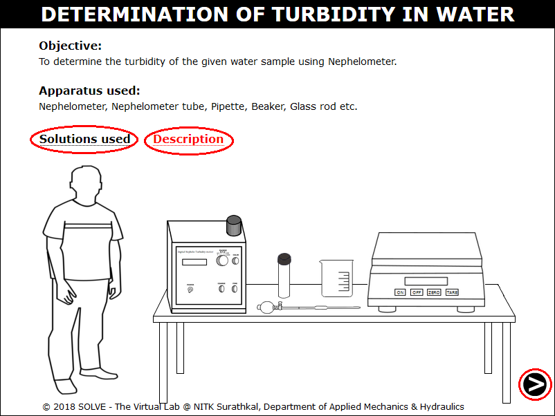 

2. Add 1g of Hydrazine Sulphate to a beaker placed on the weighing balance by clicking on the spatula. 
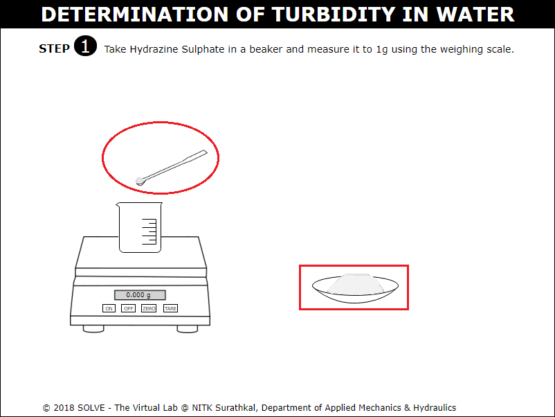 

3. Add 100ml of distilled water to the beaker by clicking on it, and stir it by clicking the glass rod, solution 1 is prepared. 
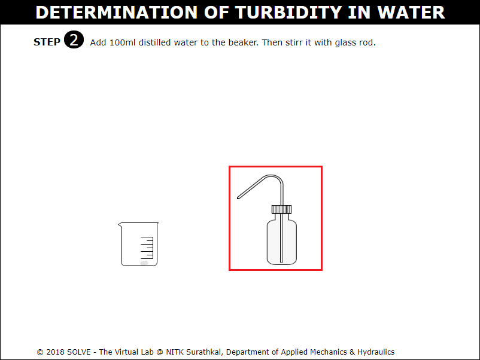 

4. Add 10g of Hexamethylenetetramine to a beaker placed on the weighing balance by clicking on the spatula. 
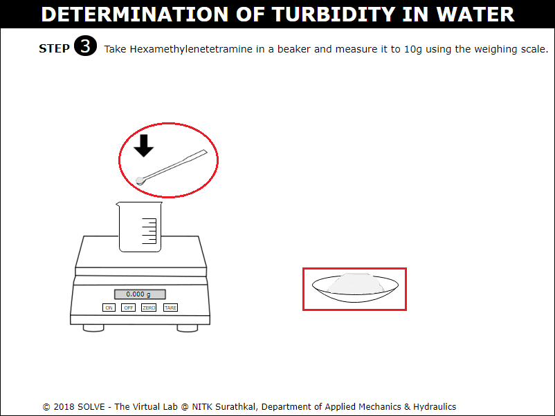 

5. Answer the question by selecting the correct answer, click on NEXT button to proceed with the simulation. 
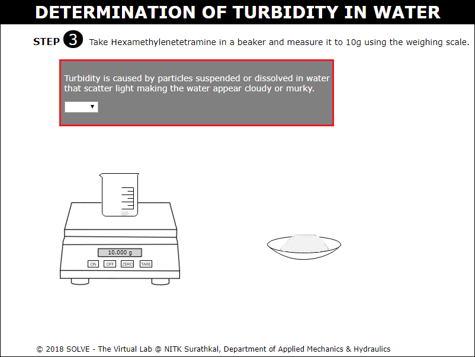 

6. Click on the glass rod to stir the sample, solution 2 is prepared. 
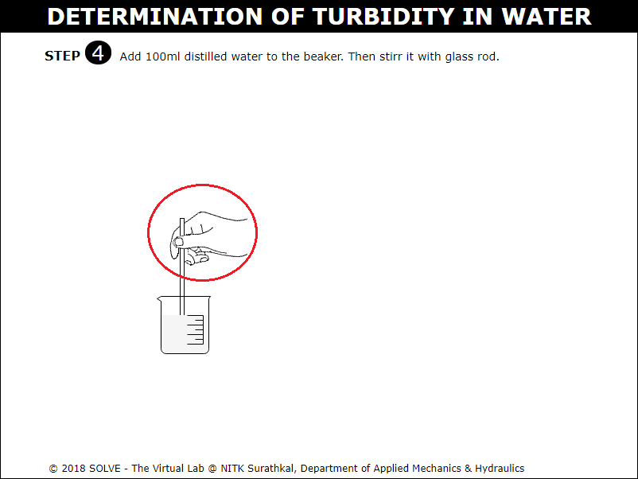 

7. Click on the graduated pipette to add 5ml of solution 1 and 5ml of solution 2 into a beaker. 
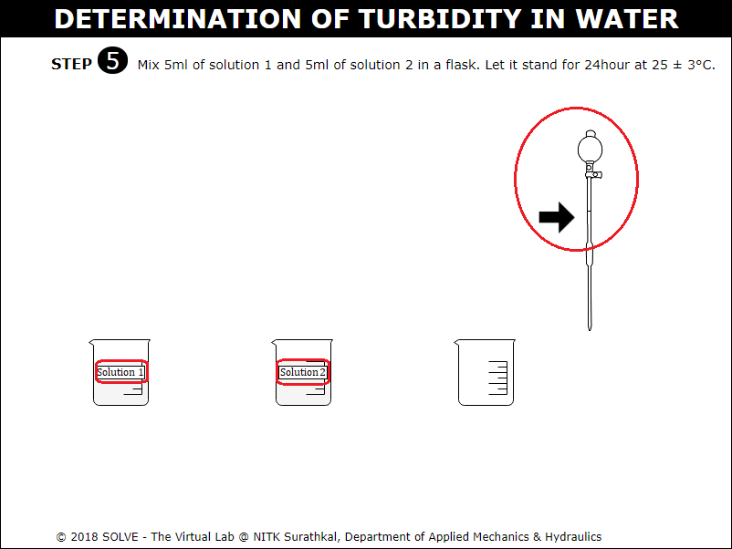 

8. Click on Nephelometer tube to transfer the solution 1 and 2 from the beaker. Answer the question by selecting the correct answer, click on NEXT button to proceed. 
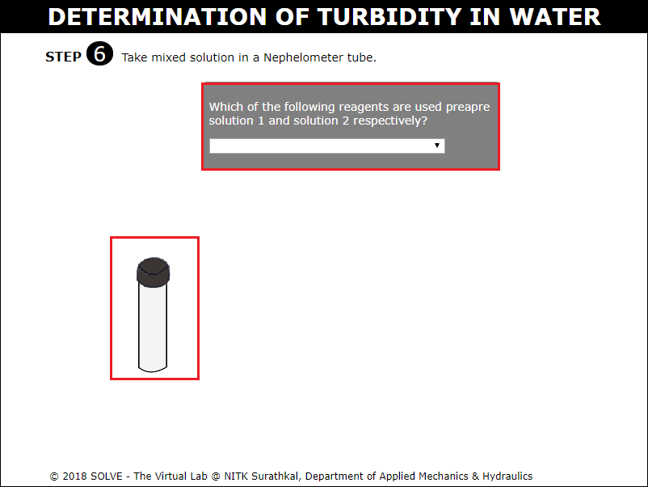 

9.  Power the Nephelometer by clicking on power button and place the sample cell with distilled water in the Nephelometer. Calibrate Nephelometer by clicking on the coarse and fine knob to adjust the reading to zero. 
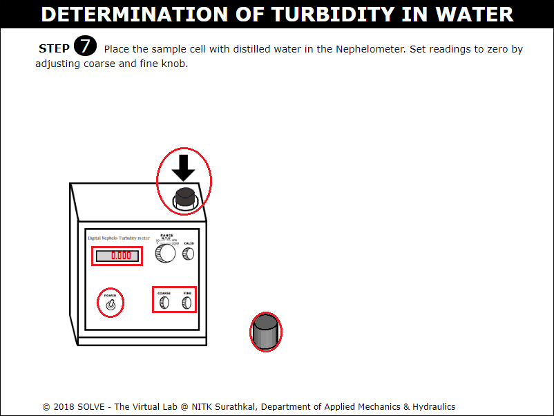 

10. Replace the sample cell of distilled water with 100 NTU calibration standard in the sample holder of Nephelometer. Calibrate Nephelometer by clicking on the coarse and fine knob to adjust the reading to hundred. 
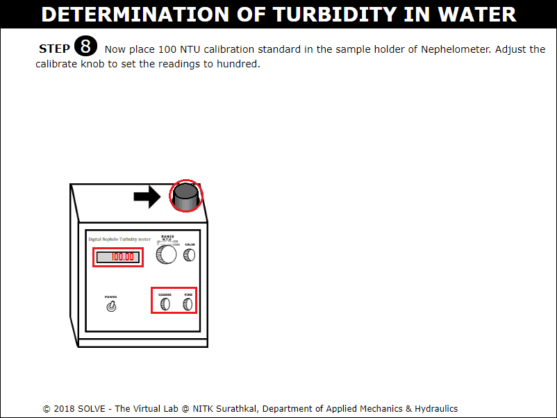 

11. Once the calibration of Nephelometer is completed, sample tube containing water solution 1 is placed in Nephelometer to measure its Turbidity. 
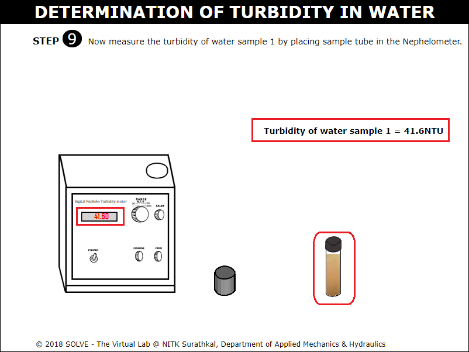 

12. Repeat the above procedure for the water sample 2 and note the Turbidity of both the water samples, go through the Inference drawn from the obtained result. 
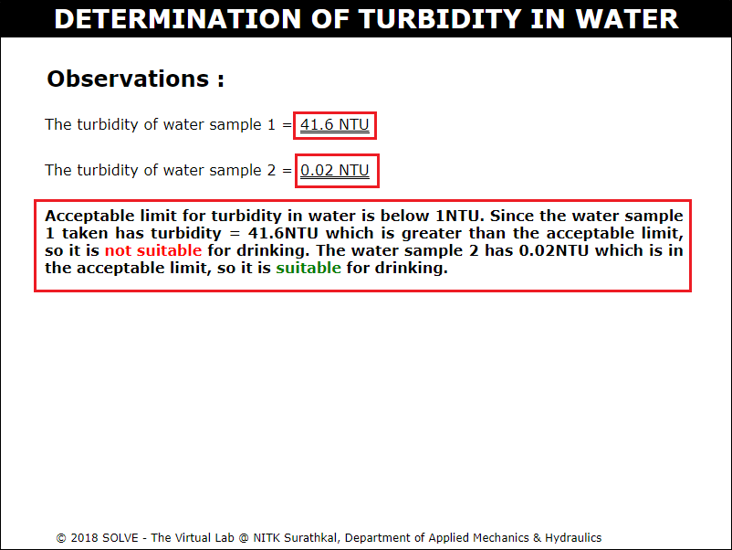 
